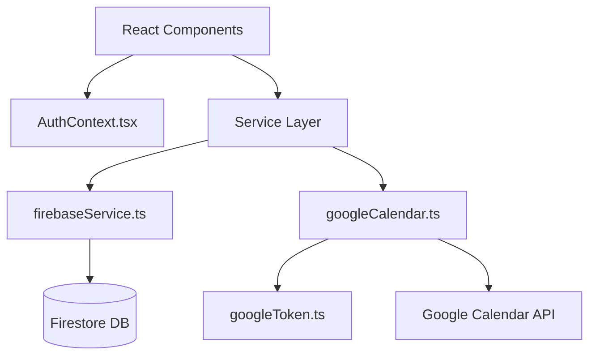

# Peer Coaching Network — AI Agent Guide

Welcome, Agent! This document acts as the definitive codebase guide, architectural reference, and runtime manual for working with the Peer Coaching Network application. 

Peer Coaching Network ("collaborative Calendly for coaches") is a Single Page Application (SPA) built using **Vite + React 19 + TypeScript** where ICF-credentialed coaches book peer coaching sessions with each other. The backend is entirely serverless, running client-side with direct connections to **Cloud Firestore** and the **Google Calendar REST API**.

---

## 🛠 Repository Commands

The project contains a [Makefile](file:///Users/premkumar/Code/peer-coaching-network/Makefile) defining developer tasks. Use these shortcuts during development:

```bash
make dev          # Start Vite dev server connecting to Firebase dev environment (runs: npm run dev)
make local        # Start local Firebase emulators and run Vite connecting to it (runs: npm run local)
make build        # Type-check TypeScript and build dev bundle (runs: npm run build:dev)
make build-dev    # Same as make build — explicit dev build (runs: npm run build:dev)
make build-prod   # Type-check TypeScript and build production bundle (runs: npm run build:prod)
make lint         # Run ESLint validation checks (runs: eslint .)
make emulator     # Start local Firebase emulator suite only (Auth on :9099, Firestore on :8080, Hosting on :5002)
make install      # Install all npm dependencies (runs: npm install)
npm run preview   # Run a local web server previewing the production build folder (dist/)
```

> [!NOTE]
> There is a unit test suite configured in this repository. Run `npm run test` or `vitest run` to execute the tests.

---

## ⚙️ Environment & Firebase Configuration

Firebase configuration is loaded dynamically via environment variables (declared in `.env.development` and `.env.emulator`) inside [firebaseService.ts](file:///Users/premkumar/Code/peer-coaching-network/src/services/firebaseService.ts) and [config.ts](file:///Users/premkumar/Code/peer-coaching-network/src/config.ts).

To keep environment files clean, any variable whose value matches its application default behavior should be ignored/omitted from the `.env` file.

Key environment flags and rules:
- **Project Default**: If variables are missing, the configuration defaults to the `peer-coaching-network-dev` project.
- **Local Emulators (`VITE_USE_FIREBASE_EMULATOR`)**: Controls whether traffic is routed to the local Firebase emulators (Auth on :9099, Firestore on :8080).
  - **Default**: `false` (runs against actual Cloud Firebase).
  - **Override**: Set `VITE_USE_FIREBASE_EMULATOR=true` in `.env.emulator` to connect to local emulators.
  - To prevent Hot Module Replacement (HMR) from attempting multiple emulator connections, the connection is guarded using a global `window._firebase_emulators_connected` flag.
- **Google Calendar Integration (`VITE_ENABLE_GOOGLE_INTEGRATION`)**: Controls whether the application integrates with the Google Calendar REST API for scheduling sessions.
  - **Default**: `true` (enables real API interactions when a token is present).
  - **Override**: Set `VITE_ENABLE_GOOGLE_INTEGRATION=false` in `.env.emulator` to disable API calls and run calendar integration in sandbox fallback mode (persisting bookings only to Firestore).
- **Logger Configuration (`VITE_LOG_LEVEL`)**: Controls the console logging output verbosity.
  - **Default**: `'error'` (prints only error logs if unset).
  - **Override**: Set to `'debug'`, `'info'`, or `'warn'` in `.env.emulator` or `.env.development` to increase logging verbosity.
- **Firestore Database ID (`VITE_FIRESTORE_DATABASE_ID`)**: Specifies which Cloud Firestore database instance to connect to.
  - **Default**: `"pcn-dev"` (uses the pcn-dev database).
- **Fail Fast Configuration**: The flag `isFirebaseConfigured` verifies if real config keys are present (or if we are on the emulator). In production, missing credentials throw a runtime exception rather than letting the application boot with broken credentials.
- **Rules & Targets**: Deploys target **Firebase Hosting** (the `dist/` directory) with SPA rewrites enabled in [firebase.json](file:///Users/premkumar/Code/peer-coaching-network/firebase.json). Firestore security rules are configured in [firestore.rules](file:///Users/premkumar/Code/peer-coaching-network/firestore.rules).

---

## 🏛 Architecture & State Flow

The codebase strictly decouples UI components from storage and calendar providers by isolating them behind a dedicated service layer:



### 1. Service Layer
- **[firebaseService.ts](file:///Users/premkumar/Code/peer-coaching-network/src/services/firebaseService.ts)**: Encapsulates Firebase initialization, Auth state, Firestore user profiles CRUD, administrative overrides, and the canonical availability calculation logic. It owns type definitions like `UserProfile`, `AvailableDays`, and `DayAvailability`.
- **[googleCalendar.ts](file:///Users/premkumar/Code/peer-coaching-network/src/services/googleCalendar.ts)**: Handles Google Calendar REST API actions (events, freebusy status, Meet links) and persists bookings to Firestore. It reads credential tokens from [googleToken.ts](file:///Users/premkumar/Code/peer-coaching-network/src/services/googleToken.ts).
- **[googleToken.ts](file:///Users/premkumar/Code/peer-coaching-network/src/services/googleToken.ts)**: Stashes and exposes OAuth tokens within `sessionStorage` (`google_access_token`).

### 2. State & Auth Flow
- **[AuthContext.tsx](file:///Users/premkumar/Code/peer-coaching-network/src/context/AuthContext.tsx)**: The single source of truth for application authentication and state. It listens to `onAuthStateChanged` and registers a live Firestore `onSnapshot` listener to the active user's document inside the `users` collection to keep state synchronized.
- **[App.tsx](file:///Users/premkumar/Code/peer-coaching-network/src/App.tsx)**: Acts as a flat router based on custom state `currentTab` (no external routing library is used). It gates the entire layout depending on user status (`approved` vs `pending`).
- **Adjust-During-Render**: App routing changes and filtering are derived during render rather than side-effects to prevent flickering or cascading-render warnings.

### 3. Role and Approval Model
Firestore profiles manage two systems for user authorization:
1. **Legacy Role**: `role: 'admin' | 'user' | null` (where `null` represents a user pending review).
2. **Current Role & Status**: `userRole: 'user' | 'admin'` alongside `userStatus: 'active' | 'inactive'`.

The helper `setUserRoleAndStatus` keeps these systems aligned by setting `role` to `userRole` if `status` is `'active'`, or `null` otherwise. A user is treated as fully approved when `isApproved()` resolves to `true` (indicating `userStatus === 'active'`). New signups start as `inactive` with a `null` legacy role, awaiting approval on the admin desk.

---

## 📅 The Availability Engine

The peer-coaching booking workflow is supported by three Firestore collections and a schedule sub-collection:
1. `users/{userId}`: Holds user profiles.
2. `users/{userId}/schedule`: Sub-collection containing:
   - `availableDays` document: Holds the weekly recurring availability template.
   - `blockedDates` document: Holds user-defined blocked dates.
3. `bookings/{bookingId}`: Contains confirmed session details (referencing `coachUid`, `clientUid`, `googleMeetLink`, and `topic`). Denormalized participant emails and names are removed and joined dynamically on the client side.
4. `busySlotsCache/{userId}`: Cache holding derived busy intervals.

### How recalculateUserBusySlotsCache Works
The function `recalculateUserBusySlotsCache(uid)` in [firebaseService.ts](file:///Users/premkumar/Code/peer-coaching-network/src/services/firebaseService.ts) runs asynchronously in the background following bookings, cancellations, or profile updates.
1. It reads the coach's weekly template and blocked dates from the `schedule` sub-collection.
2. It queries active bookings for the coach (both as host and client) for the next horizon window (configured in [config.ts](file:///Users/premkumar/Code/peer-coaching-network/src/config.ts)).
3. It maps weekly slots, blocked dates, and active bookings into UTC time windows.
4. It derives the gaps where the coach is *unavailable* and writes these busy intervals into the `busySlotsCache` collection.

To prevent concurrent writes from interleaving and corrupting user busy slots cache records, calculations are queued using a promise chain (`recalcChains` map) to serialize updates per user ID.

### Scheduling & Double-Booking Protection
- **Coach Protection**: Bookings are saved in the `bookings` collection with a deterministic identifier: `${coachUid}_${startIso}`. A transaction verifies this ID is unclaimed before scheduling a meeting.
- **Mentee Protection**: Mentees (clients) cannot double-book themselves across coaches. The scheduling flow creates a temporary placeholder in `clientBookingCache/${clientUid}_${startIso}` inside the transaction. If either check fails, the transaction aborts and no Google Calendar events are created.
- **Availability Overlay**: The method `getCoachesBusySlots` fetches busy slots caches in batches of 30 using Firestore `in` query limits. It overlays live bookings and generates fallbacks in-memory if a cached profile does not yet have a `busySlotsCache` document.
- **Stale Cache Prevention**: If a day has no busy slots registered in the cache, the busy slots overlay engine automatically marks the entire day as unavailable (busy) to prevent infinite availability leaks due to stale caches.

---

## 🌍 Timezones & Wall-Clock Corrections

- Availability templates are created using local strings (e.g. `"10:00 AM"`), but are resolved and queried in UTC ISO strings.
- Conversions are located inside [timezoneHelpers.ts](file:///Users/premkumar/Code/peer-coaching-network/src/utils/timezoneHelpers.ts).
- `getUtcForLocalDateTime` maps local wall-clock times to UTC. It implements a fixed-point convergence algorithm (up to 5 iterations) to resolve discrepancies across Daylight Savings Time (DST) changes.
- Country-to-timezone lists are mapped in [countries.ts](file:///Users/premkumar/Code/peer-coaching-network/src/utils/countries.ts) and [timezones.ts](file:///Users/premkumar/Code/peer-coaching-network/src/utils/timezones.ts). When editing profiles, selecting a country limits the timezone dropdown list to relevant options.

---

## 🔑 Google API & Calendar Specifics

- **OAuth Permissions**: Google login requests scopes to manage calendar events (`https://www.googleapis.com/auth/calendar` and `https://www.googleapis.com/auth/calendar.events`).
- **Sandbox Mode**: When Google token is absent, or when Google Calendar integration is disabled, all calendar integrations run in a fallback mode (persisting bookings only to Firestore).
- **Google Meet Links**: Scheduled meetings send POST requests to the calendar API with the parameter `conferenceDataVersion=1` to generate a real Google Meet room.
- **Bookings Sync**: Active bookings are queried by stable uids rather than emails in [googleCalendar.ts](file:///Users/premkumar/Code/peer-coaching-network/src/services/googleCalendar.ts) to prevent email mismatch issues.
- **Automated Integration**: Google Calendar sync configuration is fully automated. The application requests Google Calendar permissions during sign-in, and all confirmed coaching sessions are automatically scheduled on the Google Calendar with an automatic Google Meet video room.

---

## 🏅 Credentials System

Coaches select credentials representing their ICF level: ACC, PCC, or MCC.
- Code definitions are mapped in [credentials.ts](file:///Users/premkumar/Code/peer-coaching-network/src/utils/credentials.ts), exposing method helpers like `getShortCredential`, `getCredentialDescription`, and `getCredentialBadgeClass`.
- Credentials are read-only for coaches. Modifying credentials requires authorization and must be approved in the [AdminDashboard.tsx](file:///Users/premkumar/Code/peer-coaching-network/src/components/AdminDashboard.tsx).

---

## 🎨 Layout & Coding Conventions

- **Named Exports**: Expose modules as named exports (e.g. `export const ProfileEdit`) rather than default exports.
- **Flat Structure**: Components are stored flat within [components/](file:///Users/premkumar/Code/peer-coaching-network/src/components/).
- **CSS Styling**: The layout utilizes inline styles combined with custom CSS variables specified in [index.css](file:///Users/premkumar/Code/peer-coaching-network/src/index.css). 
- **Light/Dark Theme**: Themes are switched by appending or removing the class `.light-theme` on `document.documentElement` and reading/writing the `profile.theme` attribute.
- **TypeScript & Import Conventions**:
  - **Verbatim Module Syntax**: When importing type definitions, prefix them with the `type` keyword (e.g. `import { type UserRole, type UserStatus } from '../config'`) to comply with `verbatimModuleSyntax` and prevent build failures.
- **Constant & Type Naming Conventions**:
  - **No Hardcoded Options**: Fixed option values (roles, user statuses, themes, genders, qualifications, navigation tabs, and log severities) must never be hardcoded. They should reference centralized object constants in `src/config.ts` (e.g., `USER_ROLE`, `USER_STATUS`, `THEME`, `GENDER`, `QUALIFICATION`, `LOG_SEVERITY`, and `TABS`).
  - **Suffix Consistency**: Union types derived from config option arrays must not use the `"Value"` suffix (e.g. use `Gender`, `Theme`, `Qualification`, `UserRole`, `UserStatus`, and `LogSeverity` consistently).
- **Component Overview**:
  - [Header.tsx](file:///Users/premkumar/Code/peer-coaching-network/src/components/Header.tsx): The top header layout.
  - [LeftNav.tsx](file:///Users/premkumar/Code/peer-coaching-network/src/components/LeftNav.tsx): Side navigation menu.
  - [CoachDashboard.tsx](file:///Users/premkumar/Code/peer-coaching-network/src/components/CoachDashboard.tsx): Main dashboard showing a 56-day scrollable carousel of days and lists of available coaching slots.
  - [ScheduleModal.tsx](file:///Users/premkumar/Code/peer-coaching-network/src/components/ScheduleModal.tsx): Booking modal where users select meeting topics and confirm times.
  - [MyBookings.tsx](file:///Users/premkumar/Code/peer-coaching-network/src/components/MyBookings.tsx): Lists personal upcoming and completed sessions with option to cancel.
  - [ProfileEdit.tsx](file:///Users/premkumar/Code/peer-coaching-network/src/components/ProfileEdit.tsx): Form editing timezone, country, bio, and gender.
  - [AvailabilityEdit.tsx](file:///Users/premkumar/Code/peer-coaching-network/src/components/AvailabilityEdit.tsx): Setup weekly templates and dates blocked.
  - [AdminDashboard.tsx](file:///Users/premkumar/Code/peer-coaching-network/src/components/AdminDashboard.tsx): Admin desk allowing user status activation, role updates, and custom qualifications allocation.
  - [VerificationNotice.tsx](file:///Users/premkumar/Code/peer-coaching-network/src/components/VerificationNotice.tsx): Panel shown to pending/inactive users.
  - [SystemLogs.tsx](file:///Users/premkumar/Code/peer-coaching-network/src/components/SystemLogs.tsx): Admin-only real-time log viewer paginating the `systemLogs` Firestore collection with multi-select severity filtering.

---

## 🎨 Theme System

- **Supported values**: `'light' | 'dark'` only. The legacy `'system'` value (which wired a `prefers-color-scheme` media query listener) has been **removed**.
- **New user default**: `theme: 'light'` is set on signup in `firebaseService.ts`.
- **Application**: `App.tsx` applies/removes the `.light-theme` class on `document.documentElement`. Any stored value that is not `'light'` (including old `'system'` records) is treated as dark.
- **Toggle**: `LeftNav.tsx` flips between `'light'` and `'dark'` directly. Treat any non-`'light'` stored value as `'dark'` before computing the next state.

---

## 🗺 Navigation Tab Keys

Tab keys are lowercase slugs set via `setCurrentTab`. The human-readable label and the key can differ — always use the **key** for routing logic, never the label.

| Key | Label | Component |
|---|---|---|
| `'dashboard'` | Dashboard | `CoachDashboard` |
| `'profile'` | My Profile | `ProfileEdit` |
| `'availability'` | My Availability | `AvailabilityEdit` |
| `'bookings'` | My Sessions | `MyBookings` |
| `'admin'` | Admin Panel | `AdminDashboard` |
| `'system-logs'` | System Logs | `SystemLogs` (admin only) |

- `setCurrentTab` is owned by `AppContent` in `App.tsx` and passed as a prop to `LeftNav` and `Header`. Sub-components like `CoachDashboard` do **not** receive it — cross-tab navigation from within a sub-component should be handled via the banner or a parent-level prop if genuinely needed.

---

## 🔔 Profile Completion Banner & Widget

### Non-blocking banner (`App.tsx`)
- A dismissible amber banner is shown at the top of the `<main>` content area on every tab **except** `'profile'` when the user's profile is incomplete.
- Fields that trigger the banner: `country` (empty string), `bio` (empty string), `gender` (`'Others'` or unset).
- The banner has a **"My Profile →"** button and an **✕ dismiss** button. It re-shows after profile changes if fields are still missing.
- **Design rule**: Never block access to dashboard or any tab over an incomplete profile. The banner is advisory only.

### Completion widget (`ProfileEdit.tsx`)
- A progress bar + percentage + per-field checklist sits above the form in `ProfileEdit`.
- Completion is computed against **local form state** (not saved Firestore state) so the bar animates live as the user fills in fields.
- Tracked fields: `Country`, `Professional Bio`, `Gender` (non-default), `Timezone`.
- Colour progression: amber (< 50%) → primary blue (≥ 50%) → green (100%).

---

## 📊 System Logs Viewer

- Located at `src/components/SystemLogs.tsx`. Admin-only; rendered when `currentTab === 'system-logs' && role === 'admin'`.
- Reads from the `systemLogs` Firestore collection, ordered by `timestamp` desc.
- **Pagination**: Uses Firestore cursor-based pagination (101-doc trick to detect `hasNext`). Cursors are stored in a `useRef` array indexed by page number.
- **Severity filter**: Multi-select chip buttons (`'error'`, `'warn'`, `'info'`). An "All" chip resets the selection. Selection maps to Firestore queries:
  - 0 or 3 selected → no `where` clause (show all)
  - 1 selected → `where('type', '==', value)` (most efficient)
  - 2 selected → `where('type', 'in', [v1, v2])`
- **Row expansion**: Clicking a row or the eye button expands a detail panel showing copyable IDs (`logId`, `userId`, `bookingId`, `clientBookingCacheId`), error codes, and a raw JSON telemetry block.
- **Do not** add an "API logging" description to this component — it surfaces system events and exceptions only.

---

## 📅 Dashboard — Refresh Button

The **Refresh** button in the "Filter Available Coaches" panel calls `loadCalendarData()`, which:
1. Re-fetches `busySlotsCache` for all coaches via `getCoachesBusySlots()`.
2. Re-fetches the current user's Google Calendar events via `getUpcomingEvents()`.

It does **not** refresh the coach list (that has its own `onSnapshot` real-time listener). The button is disabled while `loadingCalendar || loadingCoaches` is true. It is fully functional and provides a manual escape hatch when calendar data may be stale.

---

## 🧭 Light-Weight Routing & Query Parameters

For Single Page Applications (SPA) with no external routing libraries (e.g., React Router), client-side routing can be modeled using URL query parameters (e.g., `?profile=userId`):
1. **Programmatic Navigation**:
   - Use `window.history.pushState` to update search parameters without triggering a full page reload.
   - Dispatch a `PopStateEvent('popstate')` programmatically immediately after `pushState` so that other router-like components listening to the URL change can sync their state.
2. **Tab Navigation Interception**:
   - Any global tab transitions (e.g. from a side navigation panel or header) must clear active route-gating query parameters (like `profile=userId`) to return the user to the correct tab views. 
   - Define a unified tab handler that sets the current tab state and invokes `clearProfileFromUrl()` to clear parameters.
3. **History Guarding**:
   - Always check if a query parameter exists (e.g. `url.searchParams.has('profile')`) before calling `pushState` to clear it, preventing redundant entries in the browser history.

---

## ⚡ React State & Render Patterns

1. **Avoid Cascading Renders (`react-hooks/set-state-in-effect`)**:
   - Calling `setState` synchronously within the body of a `useEffect` triggers cascading render cycles.
   - Use the **adjust state during render** pattern (updating state variables conditionally inside the component render body when props or data changes, before returning JSX) to reset state variables or auto-advance indices.
   - Ensure the conditional check prevents infinite loops by verifying that the new value is different from the current state (e.g., `if (nextIdx !== -1 && nextIdx !== selectedDayIndex)`).

---

## 🎨 Carousel UX & Scroll Centering

1. **Active Tab Centering**:
   - When programmatically updating index selections in a horizontal carousel, automatically center the active DOM node.
   - Use a `useEffect` triggered by index changes to call `scrollIntoView` on the target child element:
     ```typescript
     activeEl.scrollIntoView({
       behavior: 'smooth',
       block: 'nearest',
       inline: 'center'
     });
     ```

---

## 🚀 Multi-Database Deployments & CI/CD Configuration

When working with multi-environment setups (e.g., Development and Production) that target distinct Firebase project IDs and separate Firestore databases (e.g., `pcn-dev` and `pcn-prod`):

### 1. Multi-Database Firestore Configuration (`firebase.json`)
By default, `firebase.json` hardcodes a single `firestore` configuration. For multi-database projects, this must be converted into an **array of database configurations**:
```json
  "firestore": [
    {
      "database": "pcn-dev",
      "location": "asia-south1",
      "rules": "firestore.rules",
      "indexes": "firestore.indexes.json"
    },
    {
      "database": "pcn-prod",
      "location": "asia-south1",
      "rules": "firestore.rules",
      "indexes": "firestore.indexes.json"
    }
  ]
```

### 2. Dynamic Target Deployment
Instead of standard deployments that target all configurations, specify the target database dynamically in your deployment command using the `--only` flag. This avoids database-not-found errors during deployment to environments where not all databases exist:
```yaml
args: deploy --only firestore:${{ vars.DEV_VITE_FIRESTORE_DATABASE_ID }},hosting --project ${{ vars.DEV_VITE_FIREBASE_PROJECT_ID }}
```

### 3. Debugging CI/CD Failures
Always use the `--debug` flag in the deployment arguments inside GitHub Actions. If a step fails (e.g., due to insufficient Service Account roles/permissions or incorrect credentials), it provides the full verbose output to pinpoint the error.

### 4. Variables vs. Secrets Configuration
*   **Variables**: Environment variables prefixed with `VITE_` (such as project IDs, API keys, or database IDs) are injected directly into the client bundle at build-time. Since they are exposed in the client's browser, they are public by design and must be stored as **GitHub Variables**.
*   **Secrets**: Administrative credentials (such as `DEV_FIREBASE_SERVICE_ACCOUNT` or any private key files) must never be public and must be stored as encrypted **GitHub Secrets**.

---

## ✉️ Invited Users & Google Profile Sync

### 1. The `invitedUsersCache` Collection
To bypass the default manual verification queue, admins can pre-approve coaches by inviting them. These invitations are stored in the `invitedUsersCache` collection:
* **Key**: The lowercased email address of the invited coach (e.g., `invitedUsersCache/coach@example.com`).
* **TTL Policy (7-Day Expiry)**: Documents contain `createdAt` and `expiresAt` timestamps. The invitation has a Time To Live (TTL) of 7 days (`createdAt + 604800 seconds`).
* **Expiry Check**: Because Firestore TTL deletion is eventually consistent, client queries and the login resolver must filter out/reject expired invitations where `expiresAt < now`.
* **Revoking**: Admins can revoke active invitations at any time, which deletes the corresponding document from the cache.

### 2. First-Login Check & Merge
When a user authenticates via Google Sign-In for the first time (i.e. `users/{uid}` does not exist):
1. The system checks if a valid, non-expired invitation exists at `invitedUsersCache/{lowercasedEmail}`.
2. If found, the user profile document is created directly with `userStatus: 'active'`, `userRole` matching the invited role, and `qualifications: []`. Google's name, email, and photoURL take priority.
3. The temporary invitation document in `invitedUsersCache` is deleted.
4. If no valid invitation is found, the system registers the user using the fallback signup flow (`userStatus: 'inactive'`, `userRole: 'user'`).

### 3. Google Profile Syncing
To ensure profile details remain up-to-date and take priority:
* On every successful login (for both new and existing users), the authentication engine compares the user's Firestore `displayName`, `email`, and `photoURL` with the values returned by Google.
* If any discrepancies are found, the Firestore document is updated to match Google's credentials.


