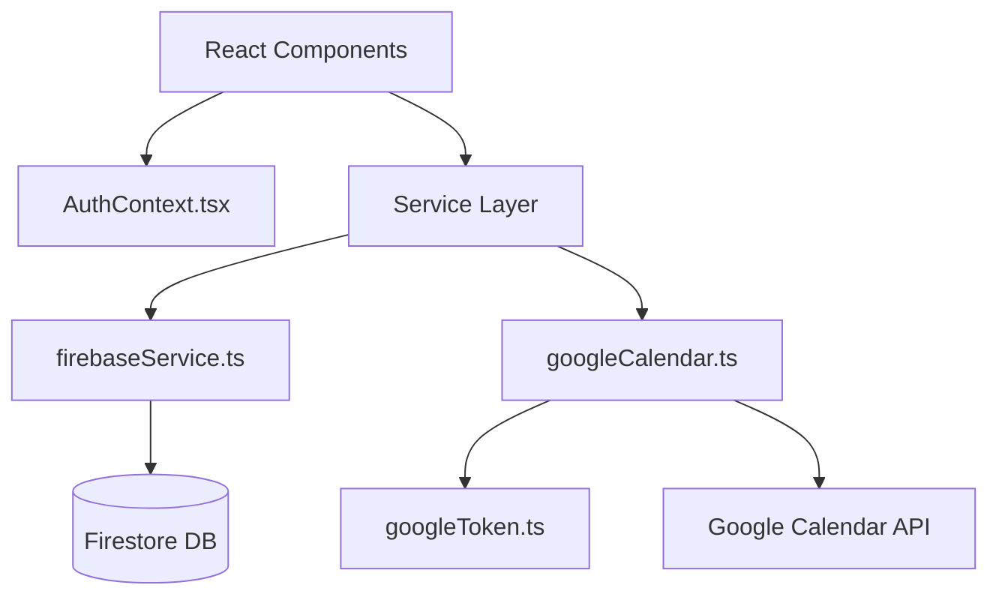

# Peer Coaching Network — AI Agent Guide

Welcome, Agent! This document acts as the definitive codebase guide, architectural reference, and runtime manual for working with the Peer Coaching Network application. 

Peer Coaching Network ("collaborative Calendly for coaches") is a Single Page Application (SPA) built using **Vite + React 19 + TypeScript** where ICF-credentialed coaches book peer coaching sessions with each other. The backend is entirely serverless, running client-side with direct connections to **Cloud Firestore** and the **Google Calendar REST API**.

---

## 🛠 Repository Commands

The project contains a [Makefile](file:///Users/premkumar/Code/peer-coaching-network/Makefile) defining developer tasks. Use these shortcuts during development:

```bash
make run          # Start Vite dev server connecting to Firebase dev environment (runs: npm run dev)
make local        # Start local Firebase emulators and run Vite connecting to it (runs: firebase emulators:exec "npm run local")
make build        # Type-check TypeScript and build production bundle (runs: tsc -b && vite build)
make lint         # Run ESLint validation checks (runs: eslint .)
make emulator     # Start local Firebase emulator suite only (Auth on :9099, Firestore on :8080, Hosting on :5002)
make install      # Install all npm dependencies (runs: npm install)
npm run preview   # Run a local web server previewing the production build folder (dist/)
```

> [!NOTE]
> There is **no unit or integration testing framework** configured in this repository. Do not attempt to run `npm test` or equivalent commands.

---

## ⚙️ Environment & Firebase Configuration

Firebase configuration is loaded dynamically via `VITE_FIREBASE_*` environment variables (declared in `.env.dev`, `.env.local`, and `.env.prod`) inside [firebaseService.ts](file:///Users/premkumar/Code/peer-coaching-network/src/services/firebaseService.ts).

Key rules for Firebase configurations:
- **Project Default**: If variables are missing, the configuration defaults to the `peer-coaching-network-dev` project.
- **Local Emulators**: Set `VITE_USE_FIREBASE_EMULATOR=true` to route Auth and Firestore traffic to the local emulator suite. To prevent Hot Module Replacement (HMR) from attempting multiple emulator connections, the connection is guarded using a global `window._firebase_emulators_connected` flag.
- **Fail Fast Configuration**: The flag `isFirebaseConfigured` verifies if real config keys are present (or if we are on the emulator). In production, missing credentials throw a runtime exception rather than letting the application boot with broken credentials.
- **Rules & Targets**: Deploys target **Firebase Hosting** (the `dist/` directory) with SPA rewrites enabled in [firebase.json](file:///Users/premkumar/Code/peer-coaching-network/firebase.json). Firestore security rules are configured in [firestore.rules](file:///Users/premkumar/Code/peer-coaching-network/firestore.rules).

---

## 🏛 Architecture & State Flow

The codebase strictly decouples UI components from storage and calendar providers by isolating them behind a dedicated service layer:



### 1. Service Layer
- **[firebaseService.ts](file:///Users/premkumar/Code/peer-coaching-network/src/services/firebaseService.ts)**: Encapsulates Firebase initialization, Auth state, Firestore user profiles CRUD, administrative overrides, and the canonical availability calculation logic. It owns type definitions like `UserProfile`, `AvailableDays`, and `DayAvailability`.
- **[googleCalendar.ts](file:///Users/premkumar/Code/peer-coaching-network/src/services/googleCalendar.ts)**: Handles Google Calendar REST API actions (events, freebusy status, Meet links) and persists bookings to Firestore. It reads credential tokens from [googleToken.ts](file:///Users/premkumar/Code/peer-coaching-network/src/services/googleToken.ts).
- **[googleToken.ts](file:///Users/premkumar/Code/peer-coaching-network/src/services/googleToken.ts)**: Stashes and exposes OAuth tokens within `sessionStorage` (`google_access_token`).

### 2. State & Auth Flow
- **[AuthContext.tsx](file:///Users/premkumar/Code/peer-coaching-network/src/context/AuthContext.tsx)**: The single source of truth for application authentication and state. It listens to `onAuthStateChanged` and registers a live Firestore `onSnapshot` listener to the active user's document inside the `users` collection to keep state synchronized.
- **[App.tsx](file:///Users/premkumar/Code/peer-coaching-network/src/App.tsx)**: Acts as a flat router based on custom state `currentTab` (no external routing library is used). It gates the entire layout depending on user status (`approved` vs `pending`).
- **Adjust-During-Render**: App routing changes and filtering are derived during render rather than side-effects to prevent flickering or cascading-render warnings.

### 3. Role and Approval Model
Firestore profiles manage two systems for user authorization:
1. **Legacy Role**: `role: 'admin' | 'user' | null` (where `null` represents a user pending review).
2. **Current Role & Status**: `userRole: 'user' | 'admin'` alongside `userStatus: 'active' | 'inactive'`.

The helper `setUserRoleAndStatus` keeps these systems aligned by setting `role` to `userRole` if `status` is `'active'`, or `null` otherwise. A user is treated as fully approved when `isApproved()` resolves to `true` (indicating `userStatus === 'active'`). New signups start as `inactive` with a `null` legacy role, awaiting approval on the admin desk.

---

## 📅 The Availability Engine

The peer-coaching booking workflow is supported by three Firestore collections and a schedule sub-collection:
1. `users/{userId}`: Holds user profiles.
2. `users/{userId}/schedule`: Sub-collection containing:
   - `availableDays` document: Holds the weekly recurring availability template.
   - `blockedDates` document: Holds user-defined blocked dates.
3. `bookings/{bookingId}`: Contains confirmed session details (referencing `coachUid`, `clientUid`, `googleMeetLink`, and `topic`). Denormalized participant emails and names are removed and joined dynamically on the client side.
4. `availability/{userId}`: Cache holding derived busy intervals.

### How recalculateUserAvailability Works
The function `recalculateUserAvailability(uid)` in [firebaseService.ts](file:///Users/premkumar/Code/peer-coaching-network/src/services/firebaseService.ts) runs asynchronously in the background following bookings, cancellations, or profile updates.
1. It reads the coach's weekly template and blocked dates from the `schedule` sub-collection.
2. It queries active bookings for the coach (both as host and client) for the next horizon window (configured in [config.ts](file:///Users/premkumar/Code/peer-coaching-network/src/config.ts)).
3. It maps weekly slots, blocked dates, and active bookings into UTC time windows.
4. It derives the gaps where the coach is *unavailable* and writes these busy intervals into the `availability` collection.

To prevent concurrent writes from interleaving and corrupting user availability records, calculations are queued using a promise chain (`recalcChains` map) to serialize updates per user ID.

### Scheduling & Double-Booking Protection
- **Coach Protection**: Bookings are saved in the `bookings` collection with a deterministic identifier: `${coachUid}_${startIso}`. A transaction verifies this ID is unclaimed before scheduling a meeting.
- **Mentee Protection**: Mentees (clients) cannot double-book themselves across coaches. The scheduling flow creates a temporary placeholder in `slotHolds/${clientUid}_${startIso}` inside the transaction. If either check fails, the transaction aborts and no Google Calendar events are created.
- **Availability Overlay**: The method `getCoachesAvailability` fetches availability caches in batches of 30 using Firestore `in` query limits. It overlays live bookings and generates fallbacks in-memory if a cached profile does not yet have an `availability` document.
- **Stale Cache Prevention**: If a day has no busy slots registered in the cache, the availability overlay engine automatically marks the entire day as unavailable (busy) to prevent infinite availability leaks due to stale caches.

---

## 🌍 Timezones & Wall-Clock Corrections

- Availability templates are created using local strings (e.g. `"10:00 AM"`), but are resolved and queried in UTC ISO strings.
- Conversions are located inside [timezoneHelpers.ts](file:///Users/premkumar/Code/peer-coaching-network/src/utils/timezoneHelpers.ts).
- `getUtcForLocalDateTime` maps local wall-clock times to UTC. It implements a fixed-point convergence algorithm (up to 5 iterations) to resolve discrepancies across Daylight Savings Time (DST) changes.
- Country-to-timezone lists are mapped in [countries.ts](file:///Users/premkumar/Code/peer-coaching-network/src/utils/countries.ts) and [timezones.ts](file:///Users/premkumar/Code/peer-coaching-network/src/utils/timezones.ts). When editing profiles, selecting a country limits the timezone dropdown list to relevant options.

---

## 🔑 Google API & Calendar Specifics

- **OAuth Permissions**: Google login requests scopes to manage calendar events (`https://www.googleapis.com/auth/calendar` and `https://www.googleapis.com/auth/calendar.events`).
- **Sandbox Mode**: When Google token is absent, or contains the mock sentinel `'mock_google_access_token'`, all calendar integrations run in a fallback mode (persisting bookings only to Firestore).
- **Google Meet Links**: Scheduled meetings send POST requests to the calendar API with the parameter `conferenceDataVersion=1` to generate a real Google Meet room.
- **Bookings Sync**: Active bookings are queried by stable uids rather than emails in [googleCalendar.ts](file:///Users/premkumar/Code/peer-coaching-network/src/services/googleCalendar.ts) to prevent email mismatch issues.
- **Automated Integration**: Google Calendar sync configuration is fully automated. The application requests Google Calendar permissions during sign-in, and all confirmed coaching sessions are automatically scheduled on the Google Calendar with an automatic Google Meet video room.

---

## 🏅 Credentials System

Coaches select credentials representing their ICF level: ACC, PCC, or MCC.
- Code definitions are mapped in [credentials.ts](file:///Users/premkumar/Code/peer-coaching-network/src/utils/credentials.ts), exposing method helpers like `getShortCredential`, `getCredentialDescription`, and `getCredentialBadgeClass`.
- Credentials are read-only for coaches. Modifying credentials requires authorization and must be approved in the [AdminDashboard.tsx](file:///Users/premkumar/Code/peer-coaching-network/src/components/AdminDashboard.tsx).

---

## 🎨 Layout & Coding Conventions

- **Named Exports**: Expose modules as named exports (e.g. `export const ProfileEdit`) rather than default exports.
- **Flat Structure**: Components are stored flat within [components/](file:///Users/premkumar/Code/peer-coaching-network/src/components/).
- **CSS Styling**: The layout utilizes inline styles combined with custom CSS variables specified in [index.css](file:///Users/premkumar/Code/peer-coaching-network/src/index.css). 
- **Light/Dark Theme**: Themes are switched by appending or removing the class `.light-theme` on `document.documentElement` and reading/writing the `profile.theme` attribute.
- **Component Overview**:
  - [Header.tsx](file:///Users/premkumar/Code/peer-coaching-network/src/components/Header.tsx): The top header layout.
  - [LeftNav.tsx](file:///Users/premkumar/Code/peer-coaching-network/src/components/LeftNav.tsx): Side navigation menu.
  - [CoachDashboard.tsx](file:///Users/premkumar/Code/peer-coaching-network/src/components/CoachDashboard.tsx): Main dashboard showing a 56-day scrollable carousel of days and lists of available coaching slots.
  - [ScheduleModal.tsx](file:///Users/premkumar/Code/peer-coaching-network/src/components/ScheduleModal.tsx): Booking modal where users select meeting topics and confirm times.
  - [MyBookings.tsx](file:///Users/premkumar/Code/peer-coaching-network/src/components/MyBookings.tsx): Lists personal upcoming and completed sessions with option to cancel.
  - [ProfileEdit.tsx](file:///Users/premkumar/Code/peer-coaching-network/src/components/ProfileEdit.tsx): Form editing timezone, country, bio, and gender.
  - [AvailabilityEdit.tsx](file:///Users/premkumar/Code/peer-coaching-network/src/components/AvailabilityEdit.tsx): Setup weekly templates and dates blocked.
  - [AdminDashboard.tsx](file:///Users/premkumar/Code/peer-coaching-network/src/components/AdminDashboard.tsx): Admin desk allowing user status activation, role updates, and custom qualifications allocation.
  - [VerificationNotice.tsx](file:///Users/premkumar/Code/peer-coaching-network/src/components/VerificationNotice.tsx): Panel shown to pending/inactive users.
