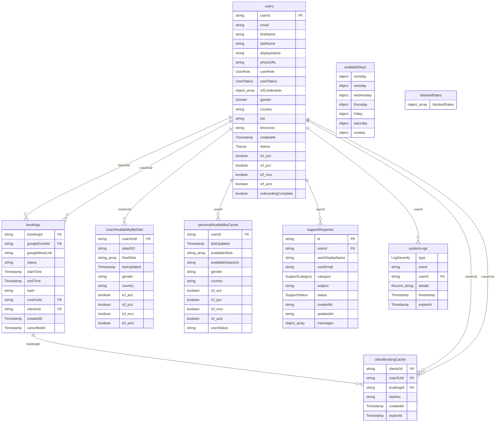

# Database Schema ERD

This document contains the Entity-Relationship Diagram (ERD) for the Peer Coaching Network database schema.

> [!NOTE]
> This file is auto-generated by running `make erd` (`scripts/generate-erd.js`). Do not edit it directly.
> Collections come from `src/config/collections.ts`; fields are inferred from Firestore writes and TypeScript interfaces across `src/`.

## Entity-Relationship Diagram

## Collection Descriptions

### 1. `availableDays`
* **Fields**: 7 (`monday`, `tuesday`, `wednesday`, `thursday`, `friday`, `saturday`, `sunday`)
* **Primary key**: _(document-scoped / composite id)_

### 2. `blockedDates`
* **Fields**: 1 (`blockedDates`)
* **Primary key**: _(document-scoped / composite id)_

### 3. `bookings`
* **Fields**: 11 (`bookingId`, `googleEventId`, `googleMeetLink`, `status`, `startTime`, `endTime`, `topic`, `coachUid`, `clientUid`, `createdAt`, `cancelledAt`)
* **Primary key**: _(document-scoped / composite id)_
* **References**: `coachUid` → `users`, `clientUid` → `users`

### 4. `clientBookingCache`
* **Fields**: 6 (`clientUid`, `coachUid`, `bookingId`, `startIso`, `createdAt`, `expireAt`)
* **Primary key**: _(document-scoped / composite id)_
* **References**: `clientUid` → `users`, `coachUid` → `users`, `bookingId` → `bookings`

### 5. `coachAvailabilityByDate`
* **Fields**: 10 (`coachUid`, `dateISO`, `freeSlots`, `lastUpdated`, `gender`, `country`, `icf_acc`, `icf_pcc`, `icf_mcc`, `icf_actc`)
* **Primary key**: _(document-scoped / composite id)_
* **References**: `coachUid` → `users`

### 6. `personalAvailabilityCache`
* **Fields**: 11 (`userId`, `lastUpdated`, `availableSlots`, `availableDatesUtc`, `gender`, `country`, `icf_acc`, `icf_pcc`, `icf_mcc`, `icf_actc`, `userStatus`)
* **Primary key**: _(document-scoped / composite id)_
* **References**: `userId` → `users`

### 7. `supportRequests`
* **Fields**: 10 (`id`, `userId`, `userDisplayName`, `userEmail`, `category`, `subject`, `status`, `createdAt`, `updatedAt`, `messages`)
* **Primary key**: `id`
* **References**: `userId` → `users`

### 8. `systemLogs`
* **Fields**: 6 (`type`, `event`, `userId`, `details`, `timestamp`, `expireAt`)
* **Primary key**: _(document-scoped / composite id)_
* **References**: `userId` → `users`

### 9. `users`
* **Fields**: 20 (`userId`, `email`, `firstName`, `lastName`, `displayName`, `photoURL`, `userRole`, `userStatus`, `icfCredentials`, `gender`, `country`, `bio`, `timezone`, `createdAt`, `theme`, `icf_acc`, `icf_pcc`, `icf_mcc`, `icf_actc`, `onboardingComplete`)
* **Primary key**: _(document-scoped / composite id)_
