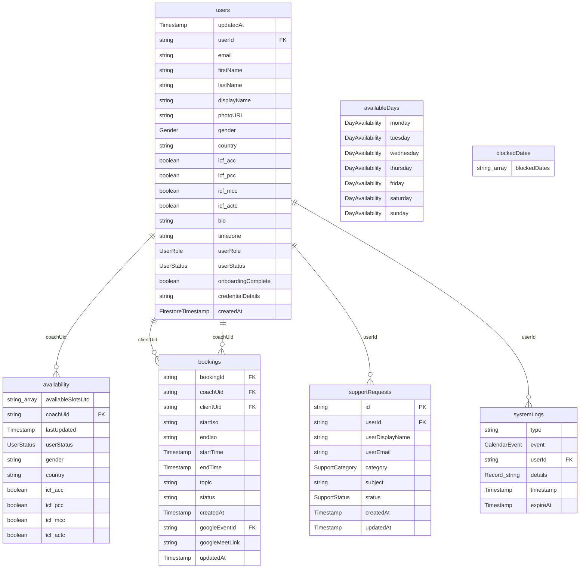

# Database Schema ERD

This document contains the Entity-Relationship Diagram (ERD) for the Peer Coaching Network database schema.

> [!NOTE]
> This file is auto-generated by running `make erd` (`scripts/generate-erd.js`). Do not edit it directly.
> Collections come from `packages/shared/src/config/collections.ts`; fields are inferred from Firestore writes and TypeScript interfaces across workspaces.

## Entity-Relationship Diagram

## Collection Descriptions

### 1. `availability`
* **Fields**: 10 (`availableSlotsUtc`, `coachUid`, `lastUpdated`, `userStatus`, `gender`, `country`, `icf_acc`, `icf_pcc`, `icf_mcc`, `icf_actc`)
* **Primary key**: _(document-scoped / composite id)_
* **References**: `coachUid` → `users`

### 2. `availableDays`
* **Fields**: 7 (`monday`, `tuesday`, `wednesday`, `thursday`, `friday`, `saturday`, `sunday`)
* **Primary key**: _(document-scoped / composite id)_

### 3. `blockedDates`
* **Fields**: 1 (`blockedDates`)
* **Primary key**: _(document-scoped / composite id)_

### 4. `bookings`
* **Fields**: 13 (`bookingId`, `coachUid`, `clientUid`, `startIso`, `endIso`, `startTime`, `endTime`, `topic`, `status`, `createdAt`, `googleEventId`, `googleMeetLink`, `updatedAt`)
* **Primary key**: _(document-scoped / composite id)_
* **References**: `coachUid` → `users`, `clientUid` → `users`

### 5. `supportRequests`
* **Fields**: 9 (`id`, `userId`, `userDisplayName`, `userEmail`, `category`, `subject`, `status`, `createdAt`, `updatedAt`)
* **Primary key**: `id`
* **References**: `userId` → `users`

### 6. `systemLogs`
* **Fields**: 6 (`type`, `event`, `userId`, `details`, `timestamp`, `expireAt`)
* **Primary key**: _(document-scoped / composite id)_
* **References**: `userId` → `users`

### 7. `users`
* **Fields**: 20 (`updatedAt`, `userId`, `email`, `firstName`, `lastName`, `displayName`, `photoURL`, `gender`, `country`, `icf_acc`, `icf_pcc`, `icf_mcc`, `icf_actc`, `bio`, `timezone`, `userRole`, `userStatus`, `onboardingComplete`, `credentialDetails`, `createdAt`)
* **Primary key**: _(document-scoped / composite id)_
