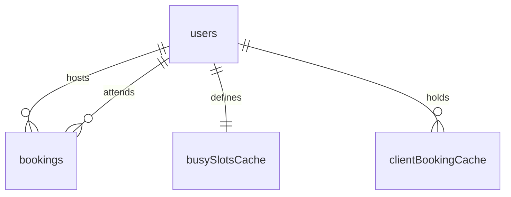

# Database Schema ERD

This document contains the Entity-Relationship Diagram (ERD) for the Peer Coaching Network database schema.

> [!NOTE]
> This file is auto-generated by running `make erd`. Do not edit this file directly.

## Entity-Relationship Diagram

## Collection Descriptions

### 1. `users`
Stores the profiles and preferences of the ICF-credentialed coaches.
* **Primary Key**: `uid` (matches the Firebase Authentication User ID).
* **Availability Template**: Defines the weekly default availability (e.g. 9:00 AM - 5:00 PM on weekdays) and any blocked dates.

### 2. `bookings`
Contains the confirmed peer coaching sessions scheduled between coaches.
* **Primary Key**: `id` (formatted as `${coachUid}_${startIso}` to prevent double-booking of a coach at the same slot).
* **Foreign Keys**: 
  - `coachUid` references `users.uid` (the host).
  - `menteeUid` references `users.uid` (the client).
* **Google Integration**: Stores `googleEventId` and `meetLink` for synced calendar events.

### 3. `clientBookingCache`
Temporary holdings created during scheduling to prevent a mentee from double-booking themselves.
* **Primary Key**: `${menteeUid}_${startIso}`.
* **Foreign Keys**:
  - `menteeUid` references `users.uid`.
  - `coachUid` references `users.uid`.
  - `bookingId` references `bookings.id`.

### 4. `busySlotsCache`
Cached busy slot records for each coach, derived dynamically to avoid expensive runtime calculations on every query.
* **Primary Key**: `uid` (references `users.uid`).
* **Busy Slots**: Aggregated array of busy time windows representing all active host and client bookings for the coach.
