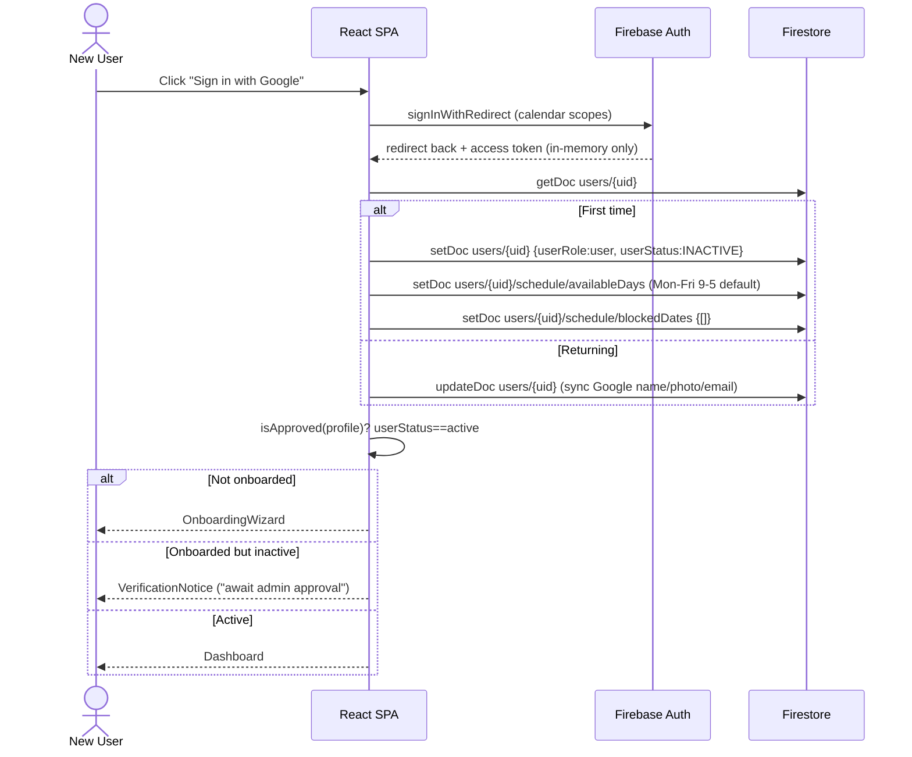
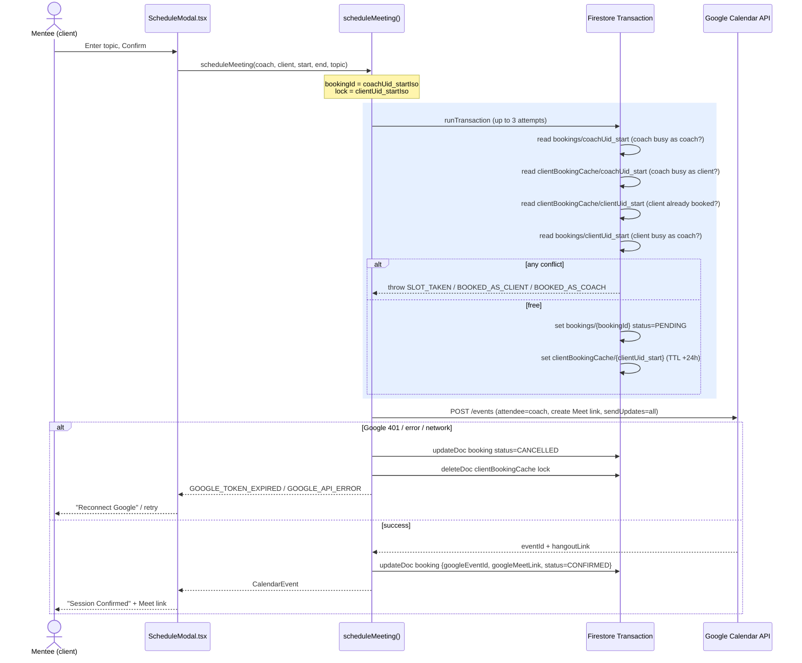
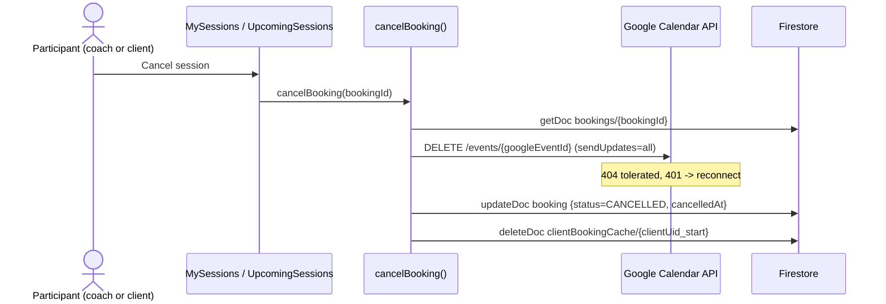

# Application Workflows

This document explains how the Peer Coaching Network works end to end: how each
coach's availability is calculated and updated, how bookings are created and
cancelled, and who is allowed to do what.

The app is a **client-only SPA** (React + Firebase, no backend services). All
"server logic" is therefore enforced in two places:

- **Firestore security rules** ([`firestore.rules`](../firestore.rules)) — the
  authorization boundary.
- **Client-side Firestore transactions** — the concurrency guard for bookings.

---

## 1. Data model — which data lives in which collection

Collection names come from [`src/config/collections.ts`](../src/config/collections.ts).

| Collection | Document ID | Holds | Who writes it |
|---|---|---|---|
| `users/{uid}` | Firebase Auth `uid` | Profile: name, email, gender, country, ICF credentials, bio, timezone, `userRole` (`user`/`admin`), `userStatus` (`active`/`inactive`) | Owner (non-privileged fields) / Admin (role + status) |
| `users/{uid}/schedule/availableDays` | fixed name `availableDays` | Weekly recurring template: 7 days, each `{ enabled, slots[] }` | Owner only |
| `users/{uid}/schedule/blockedDates` | fixed name `blockedDates` | Array of blackout date strings (max 100) | Owner only |
| `personalAvailabilityCache/{uid}` | `= uid` | **Derived** aggregate: flat list of the coach's own bookable UTC slot ISO strings across the whole horizon (+ denormalized `gender` / `country` / `icf_*` / `userStatus`). Read for the coach's **own** "My Sessions" / personal view — a single-document read | Owner (recomputed client-side) / Admin |
| `coachAvailabilityByDate/{uid}_{dateISO}` | `uid` + `_` + `YYYY-MM-DD` | **Derived** per-coach, per-day discovery shard: `coachUid`, `dateISO`, `freeSlots[]` for that date, + denormalized `gender` / `country` / `icf_*`. Powers day-scoped discovery (one small owned doc per coach per day) | Owner (doc-ID prefix must match `uid`) / Admin |
| `bookings/{coachUid}_{startIso}` | `coachUid` + start ISO | Authoritative booking: `coachUid`, `clientUid`, `startTime`, `endTime`, `topic`, `status`, `googleEventId`, `googleMeetLink` | Either participant |
| `clientBookingCache/{clientUid}_{startIso}` | `clientUid` + start ISO | Per-mentee slot lock (TTL `expireAt`) to stop double-booking yourself across coaches | The client |
| `supportRequests/{id}` | auto | Support tickets + message thread | Owner + admin |
| `systemLogs/{id}` | auto | Telemetry (TTL `expireAt`) | Anyone creates, admin reads |

**Key design idea:** `availableDays` / `blockedDates` is the **source template**.
From it (minus the coach's Google Calendar busy time) two derived views are built:
`personalAvailabilityCache` — a single aggregate doc the coach reads for their own
view — and `coachAvailabilityByDate` — per-coach, per-day shards that discovery
reads one day at a time. Splitting discovery into per-coach-per-day documents means
no two coaches ever write the same document (no hot-doc write contention at scale)
and a discovery read never pulls the whole booking horizon. Live bookings are always
read from the authoritative `bookings` collection and subtracted client-side, and
discovery re-checks the **live** `users/` profile status — the derived docs are never
trusted for "is this slot free right now" or "is this coach still active."

---

## 2. Permissions

Enforced server-side in [`firestore.rules`](../firestore.rules). `isAdmin()` =
signed-in **AND** `users/{me}.userRole == 'admin'` **AND** `userStatus == 'active'`
(a live `get()` on your own doc).

| Action | Anonymous | Signed-in `user` | Owner | Admin |
|---|---|---|---|---|
| Read any profile | ❌ | ✅ | ✅ | ✅ |
| Create own profile (must be `inactive` + `user`) | ❌ | — | ✅ (self) | ✅ |
| Edit own non-privileged fields | ❌ | ❌ | ✅ | ✅ |
| Change `userRole` / `userStatus` (approve users, make admins) | ❌ | ❌ | ❌ | ✅ |
| Edit own availability / blocked dates | ❌ | ❌ | ✅ | ✅ (as owner) |
| Create booking (must be a participant, id must start `coachUid_`, status `pending`) | ❌ | ✅ | ✅ | ✅ |
| Cancel / update booking | ❌ | participant only | ✅ | ✅ any |
| Read / manage support tickets | ❌ | own only | own | ✅ all |

There is **no self-serve admin**: new users are always created `inactive` / `user`,
and only an existing admin can flip them to `active` or `admin`.

---

## 3. Sign-up, onboarding & approval

`registerOrSyncGoogleUser` (`src/services/firebaseService.ts`) bootstraps the user
and default schedule. App gating lives in `src/App.tsx`.



**Approval step:** an admin in `UserManagement` calls `setUserRoleAndStatus` →
`updateProfile`, which writes `userStatus: 'active'` (allowed because `isAdmin()`)
and immediately triggers `recalculateAvailableSlotsCache` so the newly-active coach's
availability shards are (re)built. Discovery gates on the live profile status, so the
coach becomes discoverable as soon as their status is `active` and shards exist.

---

## 4. How availability is calculated & updated per coach

A coach edits their weekly template in `AvailabilityEdit`. Saving writes the two
`schedule/*` docs, then `doRecalculateAvailableSlotsCache` rebuilds both derived
views — the aggregate `personalAvailabilityCache/{uid}` and the per-day
`coachAvailabilityByDate/{uid}_{dateISO}` shards.

```mermaid
sequenceDiagram
    actor C as Coach (owner)
    participant AE as AvailabilityEdit.tsx
    participant FS as Firestore
    participant G as Google Calendar API
    participant Recalc as recalculateAvailableSlotsCache

    C->>AE: Edit weekly slots / block dates, Save
    AE->>FS: setDoc schedule/availableDays (7 days x slots)
    AE->>FS: setDoc schedule/blockedDates {blockedDates[]}
    Note over FS: rules: isOwner(uid) + shape validation
    AE->>Recalc: recalculateAvailableSlotsCache(uid)
    Recalc->>FS: getDoc users/{uid} (timezone, gender, country, icf_*, status)
    Recalc->>FS: getSchedule(uid) (both schedule docs)
    loop next BOOKING_HORIZON_DAYS days
        Recalc->>Recalc: skip blocked / disabled days
        Recalc->>Recalc: expand each slot into hourly UTC ISO strings
    end
    opt coach's own session (has Google token)
        Recalc->>G: POST /freeBusy (timeMin..timeMax)
        G-->>Recalc: busy intervals
        Recalc->>Recalc: subtract busy hours → freeSlots
    end
    Recalc->>FS: setDoc personalAvailabilityCache/{uid} {availableSlots(free), availableDatesUtc, gender, country, icf_*, userStatus}
    Recalc->>FS: getDocs coachAvailabilityByDate where coachUid==uid (existing shards)
    Recalc->>FS: writeBatch — set coachAvailabilityByDate/{uid}_{date} per active day; delete emptied days
```

Key points:

- **Timezone-aware:** the template stores wall-clock times; recalc converts them to
  absolute UTC using the coach's `timezone`, so a "9 AM" slot lands correctly for
  viewers in other zones.
- **Google Calendar is subtracted at recalc time.** `freeSlots = template −
  blockedDates − Google Calendar busy`. The busy lookup (`freeBusy`) is only possible
  on the coach's **own** authenticated session (their OAuth token); an admin-triggered
  recalc for another coach falls back to template-only availability.
- **Two derived writes.** The aggregate `personalAvailabilityCache` backs the coach's own
  single-doc "My Sessions" read; the `coachAvailabilityByDate` shards (one per active UTC
  date) back discovery. Shards for days that lost all availability are deleted so they
  stop matching discovery queries. Hourly slots are **deduplicated**, so overlapping
  template ranges (e.g. 9–12 and 11–14) can't double-count an hour.
- **Shards are rebuilt only on the coach's own session.** Firestore rules pin each shard's
  document ID to `{ownUid}_{dateISO}` with no admin fallback — a batched write of ~30
  shards would otherwise spend `isAdmin()` `get()` calls per document and exceed
  Firestore's 20-document-access budget. An admin-triggered recalc (profile/credential
  edits) refreshes the aggregate cache only; the coach's shards rebuild on their next own
  recalc. Because discovery gates on the live `users/` profile, an admin status change
  takes effect immediately without any shard write.
- **Denormalized filter fields** (`gender` / `country` / `icf_*`) are copied onto the
  shards so discovery can facet in-memory without joining `users`. `userStatus` is
  **deliberately not** on the shards — discovery gates on the live `users/` profile
  instead (see §5), so a stale/spoofed shard can never make a coach discoverable.
- **Serialized per-uid:** `recalcChains` chains concurrent recalcs so overlapping
  triggers (schedule save + profile edit) can't clobber each other.
- **Re-triggered on any relevant change:** `updateSchedule`, `updateOwnProfile`,
  admin `updateProfile`, and `updateVerifiedCredentials` all call it — because a
  status / country / gender / credential change alters what discovery should return.

---

## 5. Coach discovery (reading availability)

A mentee browses in `UpcomingSessions`, which calls `queryAvailableCoachesForDay`
for the selected day. Discovery reads only that day's shards, subtracts live
bookings, and gates on the live profile.

```mermaid
sequenceDiagram
    actor M as Mentee
    participant UI as UpcomingSessions.tsx
    participant FS as Firestore

    M->>UI: Pick a day + filters (gender/country/ICF)
    UI->>FS: query coachAvailabilityByDate where dateISO in [1-2 UTC dates]
    FS-->>UI: candidate day-shards (coachUid + freeSlots + denormalized filters)
    UI->>UI: drop self; facet gender/country/icf_* in-memory; union a coach's two shards
    UI->>FS: query bookings where startTime in [dayStart,dayEnd] AND status==confirmed
    FS-->>UI: confirmed bookings that day
    UI->>UI: build busy-set per slot (coachUid + clientUid busy)
    UI->>FS: getDocs users where documentId in candidateUids (chunks of 30)
    FS-->>UI: coach profiles
    UI->>UI: keep only live userRole==user AND isApproved (status active)
    loop each time slot
        UI->>UI: coach available if slot in freeSlots AND not in busy-set
        UI->>UI: seededShuffle + slice to COACH_DISCOVERY_LIMIT
    end
    UI-->>M: available coaches per slot
```

So **availability shown = (that day's shard `freeSlots`) − (confirmed bookings for
that coach/mentee at that time)**, restricted to coaches who are **still active per
their live profile**. Reading by exact `dateISO` keeps the query off the whole
horizon; the authoritative `bookings` collection removes anything actually taken; and
the live-profile gate ensures an inactive/pending coach with a stale shard can never
surface. `seededShuffle` (seeded by the session) fairly rotates which coaches appear
first and keeps the random set stable within a session.

> **Scaling note:** discovery currently fetches the profile of every candidate free
> that day before sampling to `COACH_DISCOVERY_LIMIT`. Bounding that fetch is tracked
> as a follow-up (issue #111).

---

## 6. Booking a session

The core of the app: `scheduleMeeting` (`src/services/googleCalendar.ts`). It uses
a **Firestore transaction to atomically claim the slot**, then creates the Google
Calendar event, then confirms — with rollback if Google fails.



Why it's built this way:

- **The transaction is the concurrency guard.** Two mentees racing for the same
  coach slot both read `bookings/{coachUid}_{start}`; only one commits, the other
  gets `SLOT_TAKEN`. The security rule also pins `bookingId` to the `coachUid_`
  prefix so a client can't fabricate a booking ID to hijack a different slot.
- **Four conflict checks** cover every double-book: coach busy as coach, coach busy
  as client, mentee already has this slot with *any* coach (the `clientBookingCache`
  lock), and mentee busy as a coach at that time.
- **Two-phase status (`pending` → `confirmed`)** means a booking only becomes
  visible to discovery (which filters `status == confirmed`) after the Google event
  exists. If Google fails, it's rolled back to `cancelled` and never counted as busy.
- The Google **access token is held in memory only** (never persisted) — an expired
  token surfaces as the "Reconnect Google" flow in the modal.

---

## 7. Cancellation

`cancelBooking` (`src/services/googleCalendar.ts`) — Google first, then Firestore,
then release the lock.



Setting `status = cancelled` immediately drops the slot out of the `confirmed`-only
subscriptions, and deleting the `clientBookingCache` lock frees the mentee to rebook
that time. The rule allows either participant **or** an admin to cancel/delete, but
`coachUid` / `clientUid` / `startTime` / `endTime` are immutable on update — you can
change status, never rewrite who/when.

---

## The mental model in one line

`schedule/*` (template, owner-written) minus Google Calendar busy → derived into
`personalAvailabilityCache` (the coach's own aggregate view) and per-day
`coachAvailabilityByDate` shards (day-scoped discovery) → filtered against live
`bookings` (authoritative, transaction-guarded) and the live `users/` profile status
at discovery time; `clientBookingCache` is the per-mentee lock that makes the booking
transaction safe; and every write boundary is enforced by
[`firestore.rules`](../firestore.rules) since there is no server.
